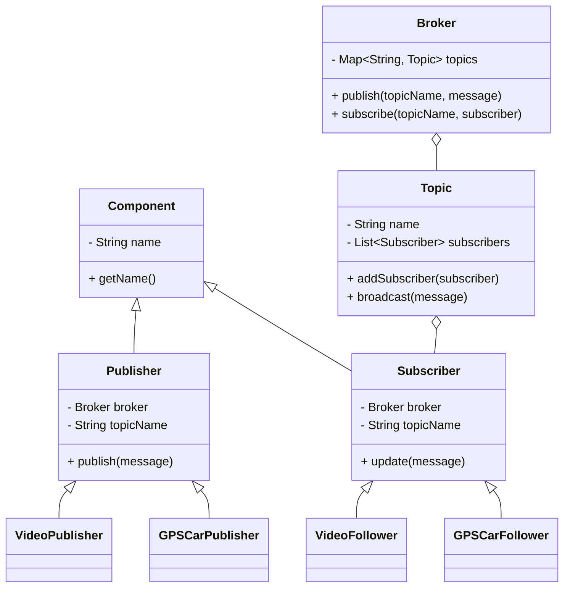

# README - Proyecto Simulador Grafico del Patron De Diseño Publicador-Suscriptor (Tarea2)

## Resumen

Este proyecto implementa un simulador basado en el patrón Publisher-Subscriber (Publicador-Suscriptor), dividido en 4 etapas de complejidad ascendente.

---
## Integrantes

Juan Monteverde.
Abraham Garcia.
Diego Saavedra.
Benjamin Matus.

---

# Etapas del Desarrollo

## **Stage 1 - Primer Publisher-Subscriber**

**Objetivo:**
- Crear publicadores de videos.
- Crear suscriptores de videos que actualizan el último video recibido en un botón.

**Solución Aplicada:**
- Creamos las clases `Publisher`, `Subscriber`, `Broker`, y `Topic`.
- Implementamos `VideoPublisher` y `VideoFollower`.
- Publicadores permiten ingresar un URL de video.
- Suscriptores muestran el último mensaje como texto en un botón.

## **Stage 2 - Reproductor de Video**

**Objetivo:**
- Al hacer click en el botón del suscriptor, reproducir el video recibido.

**Solución Aplicada:**
- Se incorporó `MediaView` y `MediaPlayer` de JavaFX.
- Agregamos controles de reproducción y volumen.

**Video usado para prueba:**
- [https://storage.googleapis.com/gtv-videos-bucket/sample/ForBiggerMeltdowns.mp4](https://storage.googleapis.com/gtv-videos-bucket/sample/ForBiggerMeltdowns.mp4)
## **Stage 3 - GPS Car Tracker**

**Objetivo:**
- Publicadores de GPS que publican la trayectoria de un auto.
- Suscriptores muestran el auto moviéndose según posiciones.

**Solución Aplicada:**
- Implementamos interpolación de posiciones con `Timeline`.
- Movimiento fluido del punto en un `Pane`.

**Archivo usado para prueba de ruta:**
```
0 100 100
3 300 100
6 300 300
9 100 300
12 100 100
```
(Archivo sugerido: `ruta_prueba.txt`)
## **Stage 4 - Simulador Completo**

**Objetivo:**
- Integrar publicadores y suscriptores de Video y GPS en un solo simulador.

**Solución Aplicada:**
- Menú de selección `Publisher` y `Subscriber`.
- Opciones para crear publicadores de video, GPS, y suscriptores.
- Sistema totalmente interactivo.

---

# Documentación Extra Usada

- [Documentación oficial de JavaFX](https://openjfx.io/)
- [Oracle JavaFX Media API](https://docs.oracle.com/javase/8/javafx/api/javafx/scene/media/Media.html)
- [StackOverflow - Uso de MediaView en JavaFX](https://stackoverflow.com/questions/28958033/javafx-mediaplayer-simple-example)
- [Foros de StackOverflow - Timeline Animation](https://stackoverflow.com/questions/27334455/animation-using-timeline-in-javafx)
- [Tutorial JavaFX Controls](https://code.makery.ch/library/javafx-tutorial/)

---

# Generación de Documentación en Javadoc

**Comando utilizado:**

```bash
javadoc --module-path /Users/juanmonteverde/IdeaProjects/javafx-sdk-24.0.1/lib --add-modules javafx.controls,javafx.fxml,javafx.media -d doc src/Stage4/*.java
```

**Pasos:**
1. Abrir terminal.
2. Ubicarse en el directorio del proyecto `tarea2`.
3. Ejecutar el comando anterior.
4. La documentación generada estará en la carpeta `doc/`.
5. Abrir `doc/index.html` en el navegador.

---

# Diagrama de Clases de Stage 4

 **Diagrama de clases**:



---

# Resumen Final

El proyecto cumple con todas las etapas requeridas:
- Comunicación entre publicadores y suscriptores.
- Reproducción multimedia.
- Trayectorias GPS.
- Integración de funcionalidades en un solo simulador.
- Documentación Javadoc generada correctamente.
- Diagrama de clases documentado.
